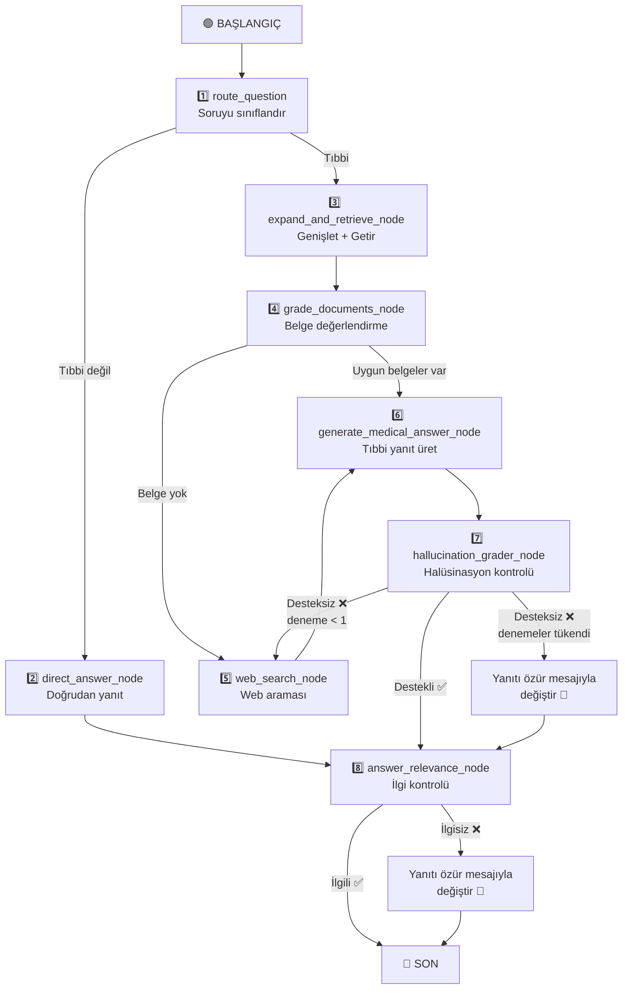

# 🌿 RAG Sistemi Sunumu - Bölüm 2
**Sunan:** Malik Fikret (Teknik Lider ve Yapay Zeka Entegrasyonu)

> [!NOTE]
> Bu bölüm, sistemin genel **LangGraph Akışı** üzerine odaklanır; özellikle Yönlendirici (Router), CRAG (Belge Değerlendirme), Web Araması mekanizmaları ve Dil Modeli (LLM) ayarlarını kapsar.

---

## Eksen 3: Tam LangGraph Akışı

### Akış Diyagramı



---

### Düğüm 1: Yönlendirici (Router)

**Dosya:** [router.py](file:///d:/aiherbal/src/herbalist_assistant/graph/nodes/router.py)

Üç katmanlı sıralı çalışır:

| Katman | Mekanizma | Açıklama |
|--------|-----------|----------|
| **Birinci** | Hızlı Regex | Selamlamaları ve kimlik sorularını algılar → `DIRECT_ANSWER` |
| **İkinci** | Hızlı Regex | Takip sorularını algılar ("Nasıl hazırlarım?") → `VECTOR_SEARCH` |
| **Üçüncü** | LLM çağrısı | Önceki katmanlar başarısız olursa → LLM karar verir (temperature=0.0) |
| **Yedek** | Fallback | LLM başarısız olursa → `VECTOR_SEARCH` varsayılır |

**Çıktılar:** `is_medical = True/False` + `generation_retries = 0`

---

### Düğüm 4: Belge Değerlendirme (Document Grading — CRAG)

**Dosya:** [grading.py](file:///d:/aiherbal/src/herbalist_assistant/graph/nodes/grading.py)

| Parametre | Değer |
|-----------|-------|
| Değerlendirilecek maksimum belge | `6` |
| Yürütme | `ThreadPoolExecutor(max_workers=4)` ile **paralel** |
| Sıcaklık | `0.0` (deterministik) |
| Değerlendirme ölçeği | `0 — 100` |
| Kabul eşiği | **`> 65`** |
| Saklanan maksimum belge | **`3`** |
| Sıralama | Puana göre azalan |

**Nasıl çalışır:**
1. 6'ya kadar aday belge alır.
2. Her belgeyi **paralel olarak** değerlendirir — LLM 0-100 puan ve gerekçe verir.
3. Puanı ≤ 65 olan belgeleri reddeder.
4. Kabul edilen en iyi 3 belgeyi alır.

**Özel kurallar:**
- Tedavi türü uyumsuzluğu cezalandırılır (dahili vs. harici).

**Değerlendirme sonrası yönlendirme:**
- Kabul edilen belgeler varsa → `"has_docs"` → Düğüm 6 (yanıt üretme)
- Kabul edilen belge yoksa → `"no_docs"` → Düğüm 5 (web araması)

---

### Düğüm 5: Web Araması (Web Search)

**Dosya:** [web_search.py](file:///d:/aiherbal/src/herbalist_assistant/graph/nodes/web_search.py)

**İki aşamalı** sistem:

```text
Aşama 1: Yalnızca güvenilir sitelerde arama (5 Türk bitkisel sitesi)
    ↓
  Sonuçlar ≥ 1 mi?
    ├─ Evet → Bu sonuçları kullan ✅
    └─ Hayır → Aşama 2: Açık web'de arama
```

| Parametre | Değer |
|-----------|-------|
| Varsayılan sağlayıcı | Tavily (`max_results=6`) |
| Yedek sağlayıcı | DuckDuckGo |
| Güvenilir site minimum sonucu | **`1`** |
| Web sonuçları değerlendirme eşiği | **`> 50`** |

- **Web sonuç değerlendirmesi:** Aynı paralel CRAG sistemi, ancak eşik `50` (yerel `65`'ten düşük çünkü web sonuçları daha kısa).
- **Tüm değerlendirme başarısız olursa:** Filtrelenmemiş orijinal sonuçlar bağlam olarak aktarılır — çünkü değerlendirilmemiş web sonuçları, tamamen boş bir bağlamdan iyidir. (Üretilen yanıt daha sonra halüsinasyon kontrolünden geçecektir).

---

## Eksen 4: Dil Modeli (LLM) Ayarları

**Dosyalar:** [groq.py](file:///d:/aiherbal/src/herbalist_assistant/llm/groq.py) + [runtime.py](file:///d:/aiherbal/src/herbalist_assistant/graph/runtime.py)

### Varsayılan Model

```text
Sağlayıcı: Groq
Model: llama-3.1-8b-instant
```

### Desteklenen Modeller

| Model | Sağlayıcı | API Anahtarı |
|-------|-----------|--------------|
| `llama-3.1-8b-instant` | Groq | `GROQ_API_KEY` |
| `llama-3.3-70b-versatile` | Groq | `GROQ_API_KEY` |
| `gemini-1.5-flash` / `gemini-2.5-flash` | Google | `GEMINI_API_KEY` |
| `deepseek-chat` | DeepSeek | `DEEPSEEK_API_KEY` |

### Role Göre Sıcaklık Değerleri

| Rol | Sıcaklık | Neden |
|-----|----------|-------|
| **Yönlendirici (Router)** | `0.0` | Deterministik karar |
| **Sorgu genişletme** | `0.4` | Sorgu üretiminde yaratıcılık |
| **Değerlendirici (Grader)** | `0.0` | Deterministik değerlendirme |
| **Yanıt üretme** | `0.2` | Olgusal yanıtlar için sınırlı yaratıcılık |
| **Özür mesajı** | `0.2` | Yanıt üreticiyle aynı |

---

## Tam Akış Özeti

> Kullanıcı sorusu → **Sınıflandırma** (tıbbi/genel) → **Sorgu genişletme** (7 varyant) → **Geri getirme** (varyant başına 5 belge) → **Paralel CRAG değerlendirme** (en iyi 3, eşik > 65) → **Yanıt üretme** → **Halüsinasyon kontrolü** (başarısızlıkta değiştirme) → **İlgi kontrolü** (başarısızlıkta değiştirme) → **Son yanıt**
