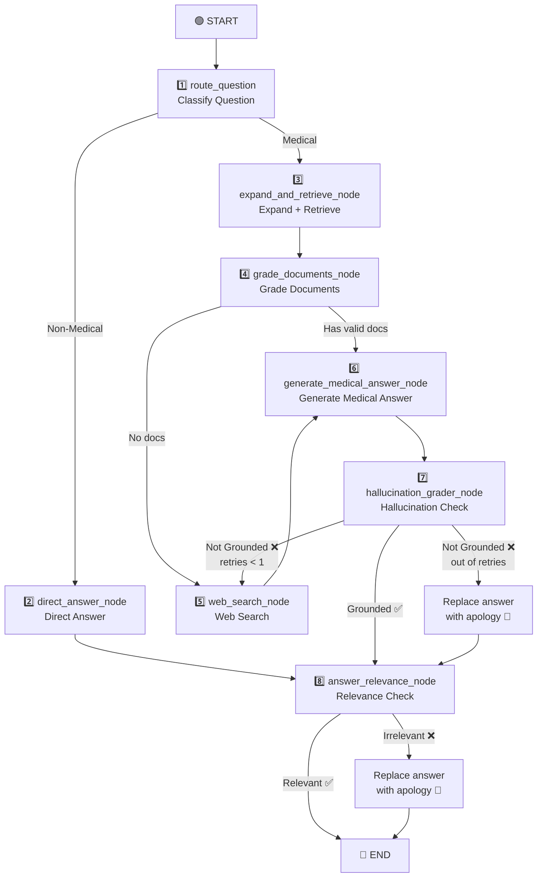

# 🌿 RAG System Presentation - Part 2
**Presenter:** Malik Fikret (Tech Lead and AI Integration)

> [!NOTE]
> This section focuses on the overall **LangGraph Flow** of the system, specifically covering the Router, CRAG (Document Grading), Web Search mechanisms, and Language Model (LLM) settings.

---

## Axis 3: Full LangGraph Flow

### Flow Diagram



---

### Node 1: Router

**File:** [router.py](file:///d:/aiherbal/src/herbalist_assistant/graph/nodes/router.py)

Works in three sequential layers:

| Layer | Mechanism | Description |
|-------|-----------|-------------|
| **First** | Fast Regex | Detects greetings and identity questions → `DIRECT_ANSWER` |
| **Second** | Fast Regex | Detects follow-up questions ("How do I prepare it?") → `VECTOR_SEARCH` |
| **Third** | LLM Call | If the first two fail → LLM decides (temperature=0.0) |
| **Fallback** | Fallback | If the LLM fails → defaults to `VECTOR_SEARCH` |

**Outputs:** `is_medical = True/False` + `generation_retries = 0`

---

### Node 4: Document Grading (CRAG)

**File:** [grading.py](file:///d:/aiherbal/src/herbalist_assistant/graph/nodes/grading.py)

| Parameter | Value |
|-----------|-------|
| Max docs to grade | `6` |
| Execution | **Parallel** via `ThreadPoolExecutor(max_workers=4)` |
| Temperature | `0.0` (Deterministic) |
| Grading scale | `0 — 100` |
| Acceptance threshold | **`> 65`** |
| Max kept docs | **`3`** |
| Sorting | Descending by score |

**How it works:**
1. Takes up to 6 candidate documents.
2. Grades each document **in parallel** — LLM assigns a score from 0-100 with reasoning.
3. Rejects documents with a score ≤ 65.
4. Keeps the top 3 accepted documents.

**Special grading rules:**
- Penalizes treatment type mismatch (e.g., internal vs. external use).

**Routing after grading:**
- If accepted documents remain → `"has_docs"` → Node 6 (Generate Answer)
- If no documents remain → `"no_docs"` → Node 5 (Web Search)

---

### Node 5: Web Search

**File:** [web_search.py](file:///d:/aiherbal/src/herbalist_assistant/graph/nodes/web_search.py)

Operates in a **two-stage** system:

```text
Stage 1: Search only trusted sites (5 Turkish herbal sites)
    ↓
  Results ≥ 1?
    ├─ Yes → Use these results ✅
    └─ No → Stage 2: Open web search
```

| Parameter | Value |
|-----------|-------|
| Default Provider | Tavily (`max_results=6`) |
| Fallback Provider | DuckDuckGo |
| Min trusted site results | **`1`** |
| Web grading threshold | **`> 50`** |

- **Web Results Grading:** Same parallel CRAG system, but with a threshold of `50` (lower than local `65` because web results are generally shorter).
- **If all grading fails:** The original unfiltered results are passed as context — because ungraded web results are better than a completely empty context. (The generated answer will later undergo a hallucination check).

---

## Axis 4: Large Language Model (LLM) Settings

**Files:** [groq.py](file:///d:/aiherbal/src/herbalist_assistant/llm/groq.py) + [runtime.py](file:///d:/aiherbal/src/herbalist_assistant/graph/runtime.py)

### Default Model

```text
Provider: Groq
Model: llama-3.1-8b-instant
```

### Supported Models

| Model | Provider | API Key |
|-------|----------|---------|
| `llama-3.1-8b-instant` | Groq | `GROQ_API_KEY` |
| `llama-3.3-70b-versatile` | Groq | `GROQ_API_KEY` |
| `gemini-1.5-flash` / `gemini-2.5-flash` | Google | `GEMINI_API_KEY` |
| `deepseek-chat` | DeepSeek | `DEEPSEEK_API_KEY` |

### Temperatures by Role

| Role | Temperature | Reason |
|------|-------------|--------|
| **Router** | `0.0` | Deterministic decision |
| **Query Expansion** | `0.4` | Creativity in generating queries |
| **Grader** | `0.0` | Deterministic grading |
| **Answer Generation** | `0.2` | Limited creativity for factual answers |
| **Apology Message** | `0.2` | Same as the answer generator |

---

## Full Flow Summary

> User Question → **Classify** (Medical/General) → **Expand Query** (7 variants) → **Retrieve** (5 docs per variant) → **Parallel CRAG Grading** (top 3, threshold > 65) → **Generate Answer** → **Hallucination Check** (replace on failure) → **Relevance Check** (replace on failure) → **Final Answer**
