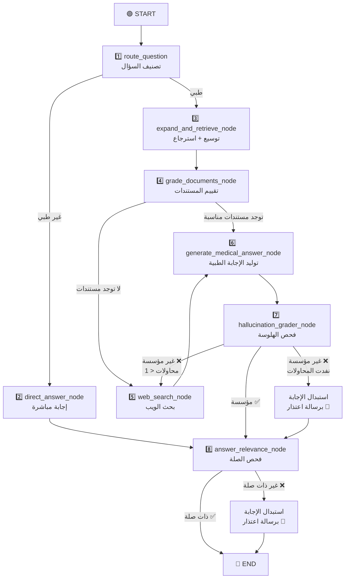

# 🌿 شرح نظام RAG — مساعد خبير الأعشاب بالذكاء الاصطناعي

> [!NOTE]
> هذا المستند يشرح كيف يعمل النظام بالكامل بعد جميع التحديثات الأخيرة.

---

## المحور الأول: جانب الفهرسة (Indexing Pipeline)

> هذا الجانب يعمل **مرة واحدة** عند بناء قاعدة البيانات، أو عند إضافة/تعديل ملفات PDF جديدة.

### ١. تحميل ملفات الـ PDF

**الملف:** [loaders.py](file:///d:/aiherbal/src/herbalist_assistant/rag/loaders.py)

- يستخدم `PyPDFLoader` من مكتبة LangChain لتحميل كل ملف PDF.
- كل **صفحة** تصبح `Document` منفصل.
- يتم إضافة اسم ملف الـ PDF كـ metadata (`pdf_filename`) لكل مستند.
- الدالة `load_pdf_documents()` تمر على جميع ملفات PDF في مجلد `data/` بالترتيب الأبجدي.

**عدد الكتب الحالية:** 17 كتاب PDF — مزيج من كتب تركية، عربية، وإنجليزية في طب الأعشاب.

---

### ٢. تقسيم المستندات إلى أجزاء (Chunking)

**الملف:** [splitter.py](file:///d:/aiherbal/src/herbalist_assistant/rag/splitter.py)

- يستخدم `RecursiveCharacterTextSplitter`.
- **حجم القطعة:** `800` حرف
- **التداخل بين القطع:** `150` حرف

**الإعدادات من:** [config.py](file:///d:/aiherbal/src/herbalist_assistant/config.py)

> [!TIP]
> التداخل (overlap) يضمن أن المعلومات التي تقع على حدود قطعتين لا تُفقد.

---

### ٣. نموذج التضمين (Embedding Model)

**الملف:** [embeddings.py](file:///d:/aiherbal/src/herbalist_assistant/rag/embeddings.py)

```
النموذج: sentence-transformers/paraphrase-multilingual-mpnet-base-v2
```

- نموذج **متعدد اللغات** — يدعم التركية والعربية والإنجليزية.
- يعمل على GPU إن توفر، وإلا على CPU.
- يتم **تطبيع المتجهات** (`normalize_embeddings=True`) لتحسين دقة البحث بالتشابه.

---

### ٤. قاعدة البيانات المتجهية (Vector Store)

**الملف:** [vectorstore.py](file:///d:/aiherbal/src/herbalist_assistant/rag/vectorstore.py)

- يستخدم **ChromaDB** كقاعدة بيانات متجهية محلية.
- المسار: مجلد `.chroma_db/` في جذر المشروع.

**كيف يعمل `load_or_build_vectorstore()`:**
1. إذا كانت قاعدة البيانات **موجودة** → يفتحها مباشرة.
2. إذا **غير موجودة** → يحمّل جميع PDFs → يقسمها → يبني ChromaDB من الصفر.

**المزامنة التزايدية `sync_new_and_changed_pdfs()`:**
- يكتشف الملفات **الجديدة** أو **المعدّلة** ويفهرسها.
- يحذف الأجزاء (chunks) للملفات **المحذوفة** من القرص.
- يستخدم `mtime_ns` (وقت آخر تعديل) لتحديد إن كان الملف تغيّر.

---

### ٥. سجل الفهرسة (Index Manifest)

**الملف:** [index_manifest.py](file:///d:/aiherbal/src/herbalist_assistant/rag/index_manifest.py)

ملف JSON في `.chroma_db/index_manifest.json` يتتبع الملفات المفهرسة:

```json
{
  "version": 1,
  "files": {
    "herbs.pdf": {"mtime_ns": 1234567890, "chunk_count": 42}
  }
}
```

- يخزن وقت آخر تعديل وعدد الأجزاء لكل ملف.
- **المجموع الكلي الحالي:** ~30,774 جزء (chunk) مخزنة في ChromaDB.

---

## المحور الثاني: جانب الاستعلام (Query Pipeline)

> هذا الجانب يعمل **كل مرة** يسأل فيها المستخدم سؤالاً طبياً عن الأعشاب.

### ١. توسيع الاستعلام (Query Expansion)

**الملف:** [retrieval.py](file:///d:/aiherbal/src/herbalist_assistant/graph/nodes/retrieval.py)

النظام **لا يبحث بسؤال واحد فقط!** بل يقوم بـ:

1. استخدام LLM (بدرجة حرارة 0.4) لتوليد **حتى 7 استعلامات** مختلفة:
   - **4 استعلامات أساسية** (primary) — بنفس لغة السؤال
   - **3 استعلامات احتياطية** (fallback) — بلغات أخرى (مصطلحات علمية إنجليزية مثلاً)
2. تشغيل **كل استعلام** في المسترجع (retriever) مع `k=5`.
3. **إزالة التكرارات** عبر SHA256 hash.
4. **تحديد سقف 12 مستند مرشح** كحد أقصى.

**نظرياً:** 7 استعلامات × 5 مستندات = 35 مستند خام → بعد إزالة التكرار ≈ 10-12 مستند فريد.

---

### ٢. استراتيجية الاسترجاع

- **النوع:** Similarity Search (بحث بالتشابه) — الافتراضي في ChromaDB.
- **عدد النتائج لكل استعلام:** `k = 5`
- المسترجع (Retriever) يُخزّن مؤقتاً عبر `@lru_cache(maxsize=1)`.

### ٣. هل يوجد إعادة ترتيب (Reranking)؟

**لا يوجد نموذج reranker مخصص.** بدلاً من ذلك، يستخدم النظام **تقييم CRAG بواسطة LLM** كفلتر ذكي متوازي للمستندات.

---

## المحور الثالث: تدفق LangGraph الكامل

### رسم تخطيطي للتدفق



---

### العقدة ١: التوجيه (Router)

**الملف:** [router.py](file:///d:/aiherbal/src/herbalist_assistant/graph/nodes/router.py)

يعمل بثلاث طبقات متتالية:

| الطبقة | الآلية | الوصف |
|--------|--------|-------|
| **الأولى** | Regex سريع | يكتشف التحيات والأسئلة عن الهوية → `DIRECT_ANSWER` |
| **الثانية** | Regex سريع | يكتشف أسئلة المتابعة ("كيف أحضره؟") → `VECTOR_SEARCH` |
| **الثالثة** | استدعاء LLM | إذا لم تنجح الطبقتان السابقتان → LLM يقرر (temperature=0.0) |
| **احتياطي** | Fallback | إذا فشل LLM → يفترض `VECTOR_SEARCH` |

**المخرجات:** `is_medical = True/False` + `generation_retries = 0`

---

### العقدة ٢: الإجابة المباشرة (Direct Answer)

**الملف:** [direct_answer.py](file:///d:/aiherbal/src/herbalist_assistant/graph/nodes/direct_answer.py)

- للتحيات، أسئلة الهوية، والمحادثة العامة.
- يستخدم اسم المستخدم فقط (ليس الملف الصحي الكامل).
- يراعي لغة الواجهة (تركي/إنجليزي).

---

### العقدة ٣: التوسيع والاسترجاع (Expand & Retrieve)

**الملف:** [retrieval.py](file:///d:/aiherbal/src/herbalist_assistant/graph/nodes/retrieval.py)

*(مشروح بالتفصيل في المحور الثاني أعلاه)*

**المخرجات:** `expanded_queries` + `candidate_docs` (حتى 12 مستند)

---

### العقدة ٤: تقييم المستندات (Document Grading — CRAG)

**الملف:** [grading.py](file:///d:/aiherbal/src/herbalist_assistant/graph/nodes/grading.py)

| المعامل | القيمة |
|---------|--------|
| أقصى عدد مستندات للتقييم | `6` |
| التنفيذ | **متوازي** عبر `ThreadPoolExecutor(max_workers=4)` |
| درجة الحرارة | `0.0` (حتمي) |
| مقياس التقييم | `0 — 100` |
| عتبة القبول | **`> 65`** |
| أقصى عدد مستندات مقبولة | **`3`** |
| الترتيب | تنازلي حسب الدرجة |

**كيف يعمل:**
1. يأخذ حتى 6 مستندات مرشحة.
2. يقيّم كل مستند **بالتوازي** — LLM يعطي درجة 0-100 مع التبرير.
3. يرفض المستندات بدرجة ≤ 65.
4. يأخذ أفضل 3 مستندات مقبولة.

**قواعد خاصة في التقييم:**
- يُعاقب عدم تطابق نوع العلاج (داخلي vs خارجي).

**التوجيه بعد التقييم:**
- إذا بقيت مستندات مقبولة → `"has_docs"` → العقدة ٦ (توليد الإجابة)
- إذا لم تبقَ أي مستندات → `"no_docs"` → العقدة ٥ (بحث الويب)

---

### العقدة ٥: بحث الويب (Web Search)

**الملف:** [web_search.py](file:///d:/aiherbal/src/herbalist_assistant/graph/nodes/web_search.py)

يعمل بنظام **مرحلتين:**

```
المرحلة ١: بحث في المواقع الموثوقة فقط (5 مواقع تركية)
    ↓
  هل النتائج ≥ 1؟
    ├─ نعم → استخدم هذه النتائج ✅
    └─ لا → المرحلة ٢: بحث مفتوح في الويب
```

| المعامل | القيمة |
|---------|--------|
| المزود الافتراضي | Tavily (`max_results=6`) |
| المزود الاحتياطي | DuckDuckGo |
| الحد الأدنى لنتائج المواقع الموثوقة | **`1`** |
| عتبة تقييم نتائج الويب | **`> 50`** |

- **تقييم نتائج الويب:** نفس نظام CRAG المتوازي لكن بعتبة `50` (أقل من المحلي `65` لأن نتائج الويب أقصر).
- **إذا فشل كل التقييم:** يُرجع النتائج الأصلية بدون تصفية إلى **العقدة ٦ (توليد الإجابة)** لاستخدامها كسياق — لأن نتائج ويب غير مُقيّمة أفضل من سياق فارغ تماماً. (الإجابة المولّدة ستخضع لاحقاً لفحص الهلوسة وفحص الصلة).

---

### العقدة ٦: توليد الإجابة الطبية

**الملف:** [medical_answer.py](file:///d:/aiherbal/src/herbalist_assistant/graph/nodes/medical_answer.py)

1. يجمع المستندات المقبولة (من RAG المحلي أو بحث الويب).
2. يبني **سياق المعلومات** من المستندات (المصدر، الصفحة، الرابط، المحتوى).
3. يبني **سياق المستخدم** (الاسم، العمر، الجنس، الحساسيات، الحالات الصحية + متطلبات السلامة).
4. يضيف سجل المحادثة للاستمرارية.
5. يستدعي LLM بدرجة حرارة `0.2`.
6. **تنظيف الإجابة** — يزيل عبارات مثل "استشر طبيبك"، "based on the context"، "doktora danışın".

---

### العقدة ٧: فحص الهلوسة (Hallucination Check)

**الملف:** [grading.py](file:///d:/aiherbal/src/herbalist_assistant/graph/nodes/grading.py)

- يتحقق: هل الإجابة **مبنية فعلاً** على المستندات المسترجعة؟
- **أقصى محاولات إعادة:** `1`

| الحالة | الإجراء |
|--------|---------|
| مؤسسة ✅ | → فحص صلة الإجابة (العقدة ٨) |
| هلوسة ❌ + محاولات < 1 | → إعادة عبر بحث الويب |
| هلوسة ❌ + نفدت المحاولات | → **استبدال الإجابة برسالة اعتذار ديناميكية** عبر `_generate_polite_fallback()` |

> [!IMPORTANT]
> **تحديث أمان:** بعد التحديث الأخير، لم تعد الإجابات غير المؤسسة تمر للمستخدم. بدلاً من ذلك، يتم استبدالها برسالة اعتذار مولّدة بنفس لغة السؤال.

---

### العقدة ٨: فحص صلة الإجابة (Answer Relevance)

**الملف:** [grading.py](file:///d:/aiherbal/src/herbalist_assistant/graph/nodes/grading.py)

- يتحقق: هل الإجابة **تعالج فعلاً** ما سأل عنه المستخدم؟

**معايير الرفض (المحدّثة):**
- الإجابة لا تعالج جوهر السؤال بمحتوى عشبي/طبي محدد.
- الإجابة حشو عام بدون معلومات ذات صلة.
- الإجابة تتجاهل قيد سلامة صريح (حساسية، حالة صحية) — فقط إذا ذُكرت القيود في السؤال.
- الإجابة بعيدة تماماً عن الموضوع أو تتعارض مع الطلب.

| الحالة | الإجراء |
|--------|---------|
| ذات صلة ✅ | → `END` — الإجابة تصل للمستخدم |
| غير ذات صلة ❌ | → **استبدال الإجابة برسالة اعتذار ديناميكية** عبر `_generate_polite_fallback()` → `END` |

> [!IMPORTANT]
> **تحديث أمان:** بعد التحديث الأخير، لم تعد الإجابات غير المناسبة تمر للمستخدم. بدلاً من ذلك، يتم استبدالها برسالة اعتذار مولّدة بنفس لغة السؤال تذكر موضوع السؤال وتوجه المستخدم لاستشارة متخصص.

---

### آلية رسالة الاعتذار الديناميكية

**الدالة:** `_generate_polite_fallback(question, reason, model_name)`

- تستخدم `_generator_llm` لتوليد رسالة مهذبة **بنفس لغة سؤال المستخدم** (وليس لغة الواجهة).
- تذكر موضوع السؤال الأصلي.
- تُعلم المستخدم أن قاعدة البيانات لا تحتوي حالياً على معلومات كافية وأنها قيد التطوير.
- تملك رسالة احتياطية ثابتة بالإنجليزية في حال فشل الـ LLM نفسه.

---

## المحور الرابع: إعدادات نموذج اللغة (LLM)

**الملفات:** [groq.py](file:///d:/aiherbal/src/herbalist_assistant/llm/groq.py) + [runtime.py](file:///d:/aiherbal/src/herbalist_assistant/graph/runtime.py)

### النموذج الافتراضي

```
المزود: Groq
النموذج: llama-3.1-8b-instant
```

### النماذج المدعومة

| النموذج | المزود | مفتاح API |
|---------|--------|-----------|
| `llama-3.1-8b-instant` | Groq | `GROQ_API_KEY` |
| `llama-3.3-70b-versatile` | Groq | `GROQ_API_KEY` |
| `gemini-1.5-flash` / `gemini-2.5-flash` | Google | `GEMINI_API_KEY` |
| `deepseek-chat` | DeepSeek | `DEEPSEEK_API_KEY` |

### درجات الحرارة حسب الدور

| الدور | الحرارة | السبب |
|-------|---------|-------|
| **التوجيه (Router)** | `0.0` | قرار حتمي |
| **توسيع الاستعلامات** | `0.4` | إبداع في توليد الاستعلامات |
| **التقييم (Grader)** | `0.0` | تقييم حتمي |
| **توليد الإجابة** | `0.2` | إبداع محدود للإجابات الواقعية |
| **رسالة الاعتذار** | `0.2` | نفس مولّد الإجابة |

---

## ملخص التدفق الكامل

> سؤال المستخدم → **تصنيف** (طبي/عام) → **توسيع الاستعلام** (7 صيغ) → **استرجاع** (5 مستندات لكل صيغة) → **تقييم CRAG المتوازي** (أفضل 3، عتبة > 65) → **توليد الإجابة** → **فحص الهلوسة** (استبدال عند الفشل) → **فحص الصلة** (استبدال عند الفشل) → **الإجابة النهائية**
