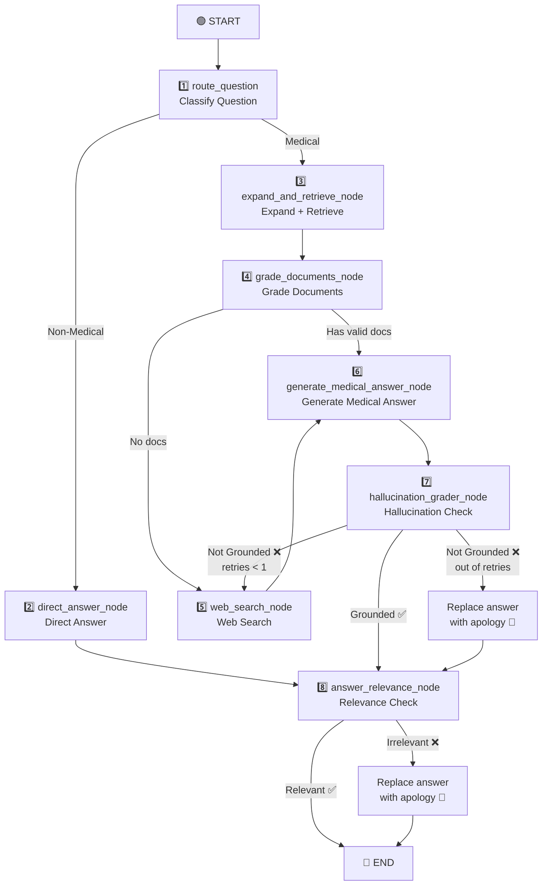

# 🌿 RAG System Walkthrough — AI Herbalist Assistant

> [!NOTE]
> This document explains how the entire system works after all the latest updates.

---

## Axis 1: Indexing Pipeline

> This pipeline runs **once** when building the database, or when new PDF files are added/modified.

### 1. Loading PDF Files

**File:** [loaders.py](file:///d:/aiherbal/src/herbalist_assistant/rag/loaders.py)

- Uses `PyPDFLoader` from the LangChain library to load each PDF file.
- Each **page** becomes a separate `Document`.
- The PDF filename is added as metadata (`pdf_filename`) to each document.
- The `load_pdf_documents()` function iterates through all PDFs in the `data/` folder in alphabetical order.

**Current Number of Books:** 17 PDF books — a mix of Turkish, Arabic, and English herbal medicine books.

---

### 2. Document Chunking

**File:** [splitter.py](file:///d:/aiherbal/src/herbalist_assistant/rag/splitter.py)

- Uses `RecursiveCharacterTextSplitter`.
- **Chunk Size:** `800` characters
- **Chunk Overlap:** `150` characters

**Settings from:** [config.py](file:///d:/aiherbal/src/herbalist_assistant/config.py)

> [!TIP]
> The overlap ensures that information located at the boundary of two chunks is not lost.

---

### 3. Embedding Model

**File:** [embeddings.py](file:///d:/aiherbal/src/herbalist_assistant/rag/embeddings.py)

```
Model: sentence-transformers/paraphrase-multilingual-mpnet-base-v2
```

- **Multilingual** model — supports Turkish, Arabic, and English.
- Runs on GPU if available, otherwise on CPU.
- Vectors are **normalized** (`normalize_embeddings=True`) to improve cosine similarity search accuracy.

---

### 4. Vector Store

**File:** [vectorstore.py](file:///d:/aiherbal/src/herbalist_assistant/rag/vectorstore.py)

- Uses **ChromaDB** as the local vector database.
- Path: `.chroma_db/` folder in the project root.

**How `load_or_build_vectorstore()` works:**
1. If the database **exists** → opens it directly.
2. If **not exists** → loads all PDFs → chunks them → builds ChromaDB from scratch.

**Incremental Sync `sync_new_and_changed_pdfs()`:**
- Detects and indexes **new** or **modified** files.
- Deletes chunks for files that have been **removed** from the disk.
- Uses `mtime_ns` (last modification time) to determine if a file has changed.

---

### 5. Index Manifest

**File:** [index_manifest.py](file:///d:/aiherbal/src/herbalist_assistant/rag/index_manifest.py)

A JSON file at `.chroma_db/index_manifest.json` tracking indexed files:

```json
{
  "version": 1,
  "files": {
    "herbs.pdf": {"mtime_ns": 1234567890, "chunk_count": 42}
  }
}
```

- Stores the last modification time and chunk count for each file.
- **Current Total:** ~30,774 chunks stored in ChromaDB.

---

## Axis 2: Query Pipeline

> This pipeline runs **every time** the user asks a medical question about herbs.

### 1. Query Expansion

**File:** [retrieval.py](file:///d:/aiherbal/src/herbalist_assistant/graph/nodes/retrieval.py)

The system **does not search with a single query!** Instead, it does the following:

1. Uses an LLM (temperature 0.4) to generate **up to 7 different queries**:
   - **4 Primary Queries** — in the same language as the user's question
   - **3 Fallback Queries** — in other languages (e.g., English scientific terms)
2. Runs **each query** through the retriever with `k=5`.
3. **Removes duplicates** using SHA256 hashing.
4. **Limits to a maximum of 12 candidate documents**.

**Theoretically:** 7 queries × 5 documents = 35 raw documents → after deduplication ≈ 10-12 unique documents.

---

### 2. Retrieval Strategy

- **Type:** Similarity Search — the default in ChromaDB.
- **Number of results per query:** `k = 5`
- The Retriever is cached via `@lru_cache(maxsize=1)`.

### 3. Is there Reranking?

**There is no dedicated reranker model.** Instead, the system uses **LLM-based CRAG grading** as an intelligent parallel filter for the documents.

---

## Axis 3: Full LangGraph Flow

### Flow Diagram



---

### Node 1: Router

**File:** [router.py](file:///d:/aiherbal/src/herbalist_assistant/graph/nodes/router.py)

Works in three sequential layers:

| Layer | Mechanism | Description |
|-------|-----------|-------------|
| **First** | Fast Regex | Detects greetings and identity questions → `DIRECT_ANSWER` |
| **Second** | Fast Regex | Detects follow-up questions ("How do I prepare it?") → `VECTOR_SEARCH` |
| **Third** | LLM Call | If the first two fail → LLM decides (temperature=0.0) |
| **Fallback** | Fallback | If the LLM fails → defaults to `VECTOR_SEARCH` |

**Outputs:** `is_medical = True/False` + `generation_retries = 0`

---

### Node 2: Direct Answer

**File:** [direct_answer.py](file:///d:/aiherbal/src/herbalist_assistant/graph/nodes/direct_answer.py)

- For greetings, identity questions, and general small talk.
- Uses only the user's name (not the full health profile).
- Respects the UI language (Turkish/English/Arabic).

---

### Node 3: Expand & Retrieve

**File:** [retrieval.py](file:///d:/aiherbal/src/herbalist_assistant/graph/nodes/retrieval.py)

*(Explained in detail in Axis 2 above)*

**Outputs:** `expanded_queries` + `candidate_docs` (up to 12 documents)

---

### Node 4: Document Grading (CRAG)

**File:** [grading.py](file:///d:/aiherbal/src/herbalist_assistant/graph/nodes/grading.py)

| Parameter | Value |
|-----------|-------|
| Max docs to grade | `6` |
| Execution | **Parallel** via `ThreadPoolExecutor(max_workers=4)` |
| Temperature | `0.0` (Deterministic) |
| Grading scale | `0 — 100` |
| Acceptance threshold | **`> 65`** |
| Max kept docs | **`3`** |
| Sorting | Descending by score |

**How it works:**
1. Takes up to 6 candidate documents.
2. Grades each document **in parallel** — LLM assigns a score from 0-100 with reasoning.
3. Rejects documents with a score ≤ 65.
4. Keeps the top 3 accepted documents.

**Special grading rules:**
- Penalizes treatment type mismatch (e.g., internal vs. external use).

**Routing after grading:**
- If accepted documents remain → `"has_docs"` → Node 6 (Generate Answer)
- If no documents remain → `"no_docs"` → Node 5 (Web Search)

---

### Node 5: Web Search

**File:** [web_search.py](file:///d:/aiherbal/src/herbalist_assistant/graph/nodes/web_search.py)

Operates in a **two-stage** system:

```
Stage 1: Search only trusted sites (5 Turkish herbal sites)
    ↓
  Results ≥ 1?
    ├─ Yes → Use these results ✅
    └─ No → Stage 2: Open web search
```

| Parameter | Value |
|-----------|-------|
| Default Provider | Tavily (`max_results=6`) |
| Fallback Provider | DuckDuckGo |
| Min trusted site results | **`1`** |
| Web grading threshold | **`> 50`** |

- **Web Results Grading:** Same parallel CRAG system, but with a threshold of `50` (lower than local `65` because web results are generally shorter).
- **If all grading fails:** The original unfiltered results are passed to **Node 6 (Generate Answer)** as context — because ungraded web results are better than a completely empty context. (The generated answer will later undergo hallucination and relevance checks).

---

### Node 6: Generate Medical Answer

**File:** [medical_answer.py](file:///d:/aiherbal/src/herbalist_assistant/graph/nodes/medical_answer.py)

1. Collects the accepted documents (from local RAG or web search).
2. Builds the **information context** from the documents (Source, Page, URL, Content).
3. Builds the **user context** (Name, Age, Gender, Allergies, Health Conditions + Safety Requirements).
4. Adds the chat history for conversational continuity.
5. Calls the LLM with a temperature of `0.2`.
6. **Answer Sanitization** — Removes phrases like "Consult your doctor", "based on the context", "doktora danışın".

---

### Node 7: Hallucination Check

**File:** [grading.py](file:///d:/aiherbal/src/herbalist_assistant/graph/nodes/grading.py)

- Checks: Is the answer **actually grounded** in the retrieved documents?
- **Max retries:** `1`

| Status | Action |
|--------|--------|
| Grounded ✅ | → Answer Relevance Check (Node 8) |
| Hallucination ❌ + retries < 1 | → Retry via Web Search |
| Hallucination ❌ + out of retries | → **Replace answer with a dynamic apology message** via `_generate_polite_fallback()` |

> [!IMPORTANT]
> **Safety Update:** Following the latest update, ungrounded answers are no longer passed to the user. Instead, they are replaced with an apology message generated in the same language as the question.

---

### Node 8: Answer Relevance Check

**File:** [grading.py](file:///d:/aiherbal/src/herbalist_assistant/graph/nodes/grading.py)

- Checks: Does the answer **actually address** what the user asked?

**Rejection Criteria (Updated):**
- The answer does not address the core of the question with specific herbal/medical content.
- The answer is general filler with no relevant information.
- The answer ignores an explicit user safety constraint (allergy, health condition) — only if constraints are mentioned in the question.
- The answer is completely off-topic or contradicts the request.

| Status | Action |
|--------|--------|
| Relevant ✅ | → `END` — Answer reaches the user |
| Irrelevant ❌ | → **Replace answer with a dynamic apology message** via `_generate_polite_fallback()` → `END` |

> [!IMPORTANT]
> **Safety Update:** Following the latest update, inappropriate answers are no longer passed to the user. Instead, they are replaced with an apology message (generated in the same language as the question) that mentions the topic and directs the user to consult a professional.

---

### Dynamic Apology Message Mechanism

**Function:** `_generate_polite_fallback(question, reason, model_name)`

- Uses the `_generator_llm` to generate a polite message **in the same language as the user's question** (not the UI language).
- Mentions the original topic of the question.
- Informs the user that the database currently does not contain sufficient information and is still under development.
- Has a hardcoded English fallback message in case the LLM call itself fails.

---

## Axis 4: Large Language Model (LLM) Settings

**Files:** [groq.py](file:///d:/aiherbal/src/herbalist_assistant/llm/groq.py) + [runtime.py](file:///d:/aiherbal/src/herbalist_assistant/graph/runtime.py)

### Default Model

```
Provider: Groq
Model: llama-3.1-8b-instant
```

### Supported Models

| Model | Provider | API Key |
|-------|----------|---------|
| `llama-3.1-8b-instant` | Groq | `GROQ_API_KEY` |
| `llama-3.3-70b-versatile` | Groq | `GROQ_API_KEY` |
| `gemini-1.5-flash` / `gemini-2.5-flash` | Google | `GEMINI_API_KEY` |
| `deepseek-chat` | DeepSeek | `DEEPSEEK_API_KEY` |

### Temperatures by Role

| Role | Temperature | Reason |
|------|-------------|--------|
| **Router** | `0.0` | Deterministic decision |
| **Query Expansion** | `0.4` | Creativity in generating queries |
| **Grader** | `0.0` | Deterministic grading |
| **Answer Generation** | `0.2` | Limited creativity for factual answers |
| **Apology Message** | `0.2` | Same as the answer generator |

---

## Full Flow Summary

> User Question → **Classify** (Medical/General) → **Expand Query** (7 variants) → **Retrieve** (5 docs per variant) → **Parallel CRAG Grading** (top 3, threshold > 65) → **Generate Answer** → **Hallucination Check** (replace on failure) → **Relevance Check** (replace on failure) → **Final Answer**
