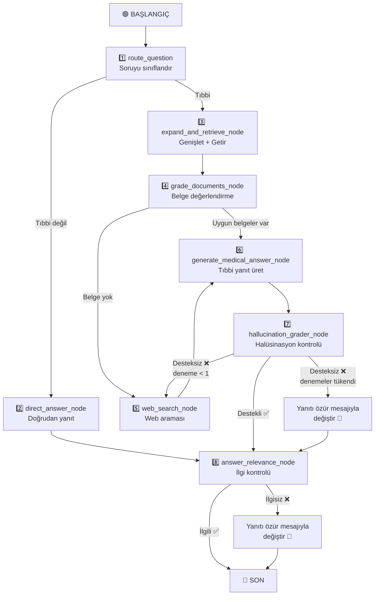

# 🌿 RAG Sistemi Açıklaması — AI Bitkisel Sağlık Asistanı

> [!NOTE]
> Bu belge, tüm son güncellemeler dahil olmak üzere sistemin nasıl çalıştığını baştan sona açıklamaktadır.

---

## Eksen 1: İndeksleme Hattı (Indexing Pipeline)

> Bu bölüm veritabanı oluşturulurken **bir kez** veya yeni PDF dosyaları eklenip değiştirildiğinde çalışır.

### 1. PDF Dosyalarının Yüklenmesi

**Dosya:** [loaders.py](file:///d:/aiherbal/src/herbalist_assistant/rag/loaders.py)

- LangChain kütüphanesinden `PyPDFLoader` kullanarak her PDF dosyasını yükler.
- Her **sayfa** ayrı bir `Document` olur.
- Her belgeye PDF dosya adı metadata olarak (`pdf_filename`) eklenir.
- `load_pdf_documents()` fonksiyonu `data/` klasöründeki tüm PDF dosyalarını alfabetik sırayla tarar.

**Mevcut kitap sayısı:** 17 PDF kitap — Türkçe, Arapça ve İngilizce bitkisel tıp kitaplarının karışımı.

---

### 2. Belgelerin Parçalara Bölünmesi (Chunking)

**Dosya:** [splitter.py](file:///d:/aiherbal/src/herbalist_assistant/rag/splitter.py)

- `RecursiveCharacterTextSplitter` kullanır.
- **Parça boyutu:** `800` karakter
- **Parçalar arası örtüşme:** `150` karakter

**Ayarlar:** [config.py](file:///d:/aiherbal/src/herbalist_assistant/config.py)

> [!TIP]
> Örtüşme (overlap), iki parçanın sınırında kalan bilgilerin kaybolmamasını sağlar.

---

### 3. Gömme Modeli (Embedding Model)

**Dosya:** [embeddings.py](file:///d:/aiherbal/src/herbalist_assistant/rag/embeddings.py)

```
Model: sentence-transformers/paraphrase-multilingual-mpnet-base-v2
```

- **Çok dilli** model — Türkçe, Arapça ve İngilizce destekler.
- GPU varsa GPU'da, yoksa CPU'da çalışır.
- Kosinüs benzerliğini iyileştirmek için vektörler **normalleştirilir** (`normalize_embeddings=True`).

---

### 4. Vektör Veritabanı (Vector Store)

**Dosya:** [vectorstore.py](file:///d:/aiherbal/src/herbalist_assistant/rag/vectorstore.py)

- Yerel vektör veritabanı olarak **ChromaDB** kullanır.
- Yol: proje kökündeki `.chroma_db/` klasörü.

**`load_or_build_vectorstore()` nasıl çalışır:**
1. Veritabanı **mevcutsa** → doğrudan açar.
2. **Mevcut değilse** → tüm PDF'leri yükler → parçalar → sıfırdan ChromaDB oluşturur.

**Artımlı senkronizasyon `sync_new_and_changed_pdfs()`:**
- **Yeni** veya **değiştirilmiş** dosyaları tespit edip indeksler.
- Diskten **silinmiş** dosyaların parçalarını (chunk) siler.
- Dosyanın değişip değişmediğini belirlemek için `mtime_ns` (son değişiklik zamanı) kullanır.

---

### 5. İndeks Manifesti (Index Manifest)

**Dosya:** [index_manifest.py](file:///d:/aiherbal/src/herbalist_assistant/rag/index_manifest.py)

`.chroma_db/index_manifest.json` dosyası indekslenen dosyaları takip eder:

```json
{
  "version": 1,
  "files": {
    "herbs.pdf": {"mtime_ns": 1234567890, "chunk_count": 42}
  }
}
```

- Her dosya için son değişiklik zamanı ve parça sayısını saklar.
- **Mevcut toplam:** ChromaDB'de ~30.774 parça (chunk) depolanmıştır.

---

## Eksen 2: Sorgulama Hattı (Query Pipeline)

> Bu bölüm kullanıcı bitkisel tıp hakkında her soru sorduğunda çalışır.

### 1. Sorgu Genişletme (Query Expansion)

**Dosya:** [retrieval.py](file:///d:/aiherbal/src/herbalist_assistant/graph/nodes/retrieval.py)

Sistem **tek bir sorguyla aramaz!** Şunları yapar:

1. LLM (sıcaklık 0.4) kullanarak **7'ye kadar farklı sorgu** üretir:
   - **4 birincil sorgu** (primary) — sorunun diliyle aynı
   - **3 yedek sorgu** (fallback) — diğer dillerde (ör. İngilizce bilimsel terimler)
2. Her sorguyu retriever'da çalıştırır (`k=5`).
3. SHA256 hash ile **tekrarları kaldırır**.
4. **Maksimum 12 aday belge** sınırı uygular.

**Teorik olarak:** 7 sorgu × 5 belge = 35 ham belge → tekrar kaldırma sonrası ≈ 10-12 benzersiz belge.

---

### 2. Geri Getirme Stratejisi

- **Tür:** Similarity Search (benzerlik araması) — ChromaDB varsayılanı.
- **Sorgu başına sonuç sayısı:** `k = 5`
- Retriever `@lru_cache(maxsize=1)` ile önbelleğe alınır.

### 3. Yeniden Sıralama (Reranking) Var mı?

**Özel bir reranker modeli yoktur.** Bunun yerine sistem, belgeler için akıllı bir paralel filtre olarak **LLM tabanlı CRAG değerlendirmesi** kullanır.

---

## Eksen 3: Tam LangGraph Akışı

### Akış Diyagramı



---

### Düğüm 1: Yönlendirici (Router)

**Dosya:** [router.py](file:///d:/aiherbal/src/herbalist_assistant/graph/nodes/router.py)

Üç katmanlı sıralı çalışır:

| Katman | Mekanizma | Açıklama |
|--------|-----------|----------|
| **Birinci** | Hızlı Regex | Selamlamaları ve kimlik sorularını algılar → `DIRECT_ANSWER` |
| **İkinci** | Hızlı Regex | Takip sorularını algılar ("Nasıl hazırlarım?") → `VECTOR_SEARCH` |
| **Üçüncü** | LLM çağrısı | Önceki katmanlar başarısız olursa → LLM karar verir (temperature=0.0) |
| **Yedek** | Fallback | LLM başarısız olursa → `VECTOR_SEARCH` varsayılır |

**Çıktılar:** `is_medical = True/False` + `generation_retries = 0`

---

### Düğüm 2: Doğrudan Yanıt (Direct Answer)

**Dosya:** [direct_answer.py](file:///d:/aiherbal/src/herbalist_assistant/graph/nodes/direct_answer.py)

- Selamlamalar, kimlik soruları ve genel sohbet için.
- Yalnızca kullanıcı adını kullanır (tam sağlık profilini değil).
- Arayüz dilini (Türkçe/İngilizce) dikkate alır.

---

### Düğüm 3: Genişletme ve Geri Getirme (Expand & Retrieve)

**Dosya:** [retrieval.py](file:///d:/aiherbal/src/herbalist_assistant/graph/nodes/retrieval.py)

*(Yukarıdaki Eksen 2'de ayrıntılı olarak açıklanmıştır)*

**Çıktılar:** `expanded_queries` + `candidate_docs` (12'ye kadar belge)

---

### Düğüm 4: Belge Değerlendirme (Document Grading — CRAG)

**Dosya:** [grading.py](file:///d:/aiherbal/src/herbalist_assistant/graph/nodes/grading.py)

| Parametre | Değer |
|-----------|-------|
| Değerlendirilecek maksimum belge | `6` |
| Yürütme | `ThreadPoolExecutor(max_workers=4)` ile **paralel** |
| Sıcaklık | `0.0` (deterministik) |
| Değerlendirme ölçeği | `0 — 100` |
| Kabul eşiği | **`> 65`** |
| Saklanan maksimum belge | **`3`** |
| Sıralama | Puana göre azalan |

**Nasıl çalışır:**
1. 6'ya kadar aday belge alır.
2. Her belgeyi **paralel olarak** değerlendirir — LLM 0-100 puan ve gerekçe verir.
3. Puanı ≤ 65 olan belgeleri reddeder.
4. Kabul edilen en iyi 3 belgeyi alır.

**Özel kurallar:**
- Tedavi türü uyumsuzluğu cezalandırılır (dahili vs. harici).

**Değerlendirme sonrası yönlendirme:**
- Kabul edilen belgeler varsa → `"has_docs"` → Düğüm 6 (yanıt üretme)
- Kabul edilen belge yoksa → `"no_docs"` → Düğüm 5 (web araması)

---

### Düğüm 5: Web Araması (Web Search)

**Dosya:** [web_search.py](file:///d:/aiherbal/src/herbalist_assistant/graph/nodes/web_search.py)

**İki aşamalı** sistem:

```
Aşama 1: Yalnızca güvenilir sitelerde arama (5 Türk bitkisel sitesi)
    ↓
  Sonuçlar ≥ 1 mi?
    ├─ Evet → Bu sonuçları kullan ✅
    └─ Hayır → Aşama 2: Açık web'de arama
```

| Parametre | Değer |
|-----------|-------|
| Varsayılan sağlayıcı | Tavily (`max_results=6`) |
| Yedek sağlayıcı | DuckDuckGo |
| Güvenilir site minimum sonucu | **`1`** |
| Web sonuçları değerlendirme eşiği | **`> 50`** |

- **Web sonuç değerlendirmesi:** Aynı paralel CRAG sistemi, ancak eşik `50` (yerel `65`'ten düşük çünkü web sonuçları daha kısa).
- **Tüm değerlendirme başarısız olursa:** Filtrelenmemiş orijinal sonuçlar **Düğüm 6'ya (yanıt üretme)** bağlam olarak aktarılır — çünkü değerlendirilmemiş web sonuçları, tamamen boş bir bağlamdan iyidir. (Üretilen yanıt daha sonra halüsinasyon ve ilgi kontrolünden geçecektir).

---

### Düğüm 6: Tıbbi Yanıt Üretme

**Dosya:** [medical_answer.py](file:///d:/aiherbal/src/herbalist_assistant/graph/nodes/medical_answer.py)

1. Kabul edilen belgeleri toplar (yerel RAG'den veya web aramasından).
2. Belgelerden **bilgi bağlamı** oluşturur (kaynak, sayfa, URL, içerik).
3. **Kullanıcı bağlamı** oluşturur (ad, yaş, cinsiyet, alerjiler, sağlık durumları + güvenlik gereksinimleri).
4. Konuşma sürekliliği için sohbet geçmişini ekler.
5. Sıcaklık `0.2` ile LLM'i çağırır.
6. **Yanıt temizleme** — "Doktorunuza danışın", "based on the context" gibi ifadeleri kaldırır.

---

### Düğüm 7: Halüsinasyon Kontrolü (Hallucination Check)

**Dosya:** [grading.py](file:///d:/aiherbal/src/herbalist_assistant/graph/nodes/grading.py)

- Kontrol: Yanıt **gerçekten** getirilen belgelere dayalı mı?
- **Maksimum yeniden deneme:** `1`

| Durum | İşlem |
|-------|-------|
| Destekli ✅ | → Yanıt ilgi kontrolüne (Düğüm 8) |
| Halüsinasyon ❌ + deneme < 1 | → Web araması ile yeniden deneme |
| Halüsinasyon ❌ + denemeler tükendi | → **Yanıt, `_generate_polite_fallback()` ile dinamik özür mesajıyla değiştirilir** |

> [!IMPORTANT]
> **Güvenlik güncellemesi:** Son güncellemeden sonra, doğrulanmamış yanıtlar artık kullanıcıya iletilmez. Bunun yerine, sorunun diliyle aynı dilde üretilmiş bir özür mesajıyla değiştirilir.

---

### Düğüm 8: Yanıt İlgi Kontrolü (Answer Relevance)

**Dosya:** [grading.py](file:///d:/aiherbal/src/herbalist_assistant/graph/nodes/grading.py)

- Kontrol: Yanıt **gerçekten** kullanıcının sorusunu karşılıyor mu?

**Red kriterleri (güncellenmiş):**
- Yanıt, sorunun özünü belirli bitkisel/tıbbi içerikle ele almıyor.
- Yanıt, ilgili bilgi içermeyen genel dolgu malzemesi.
- Yanıt, açık bir kullanıcı güvenlik kısıtlamasını (alerji, sağlık durumu) görmezden geliyor — yalnızca soruda kısıtlamalar belirtilmişse.
- Yanıt tamamen konu dışı veya taleple çelişiyor.

| Durum | İşlem |
|-------|-------|
| İlgili ✅ | → `SON` — Yanıt kullanıcıya ulaşır |
| İlgisiz ❌ | → **Yanıt, `_generate_polite_fallback()` ile dinamik özür mesajıyla değiştirilir** → `SON` |

> [!IMPORTANT]
> **Güvenlik güncellemesi:** Son güncellemeden sonra, uygun olmayan yanıtlar artık kullanıcıya iletilmez. Bunun yerine, sorunun konusunu belirten ve kullanıcıyı bir uzmana yönlendiren, sorunun diliyle aynı dilde üretilmiş bir özür mesajıyla değiştirilir.

---

### Dinamik Özür Mesajı Mekanizması

**Fonksiyon:** `_generate_polite_fallback(question, reason, model_name)`

- Kullanıcının **sorusuyla aynı dilde** (arayüz dili değil) nazik bir mesaj üretmek için `_generator_llm` kullanır.
- Orijinal sorunun konusundan bahseder.
- Kullanıcıya veritabanının bu konuda yeterli bilgiye sahip olmadığını ve sürekli geliştirildiğini bildirir.
- LLM çağrısının kendisi başarısız olursa sabit bir İngilizce yedek mesajı vardır.

---

## Eksen 4: Dil Modeli (LLM) Ayarları

**Dosyalar:** [groq.py](file:///d:/aiherbal/src/herbalist_assistant/llm/groq.py) + [runtime.py](file:///d:/aiherbal/src/herbalist_assistant/graph/runtime.py)

### Varsayılan Model

```
Sağlayıcı: Groq
Model: llama-3.1-8b-instant
```

### Desteklenen Modeller

| Model | Sağlayıcı | API Anahtarı |
|-------|-----------|--------------|
| `llama-3.1-8b-instant` | Groq | `GROQ_API_KEY` |
| `llama-3.3-70b-versatile` | Groq | `GROQ_API_KEY` |
| `gemini-1.5-flash` / `gemini-2.5-flash` | Google | `GEMINI_API_KEY` |
| `deepseek-chat` | DeepSeek | `DEEPSEEK_API_KEY` |

### Role Göre Sıcaklık Değerleri

| Rol | Sıcaklık | Neden |
|-----|----------|-------|
| **Yönlendirici (Router)** | `0.0` | Deterministik karar |
| **Sorgu genişletme** | `0.4` | Sorgu üretiminde yaratıcılık |
| **Değerlendirici (Grader)** | `0.0` | Deterministik değerlendirme |
| **Yanıt üretme** | `0.2` | Olgusal yanıtlar için sınırlı yaratıcılık |
| **Özür mesajı** | `0.2` | Yanıt üreticiyle aynı |

---

## Tam Akış Özeti

> Kullanıcı sorusu → **Sınıflandırma** (tıbbi/genel) → **Sorgu genişletme** (7 varyant) → **Geri getirme** (varyant başına 5 belge) → **Paralel CRAG değerlendirme** (en iyi 3, eşik > 65) → **Yanıt üretme** → **Halüsinasyon kontrolü** (başarısızlıkta değiştirme) → **İlgi kontrolü** (başarısızlıkta değiştirme) → **Son yanıt**
